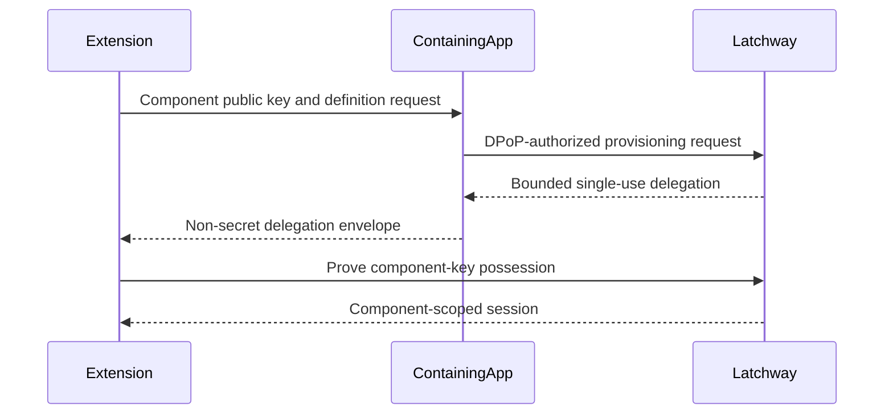

<Warning>
  This flow is defined by released contract `1.0.0` and wire protocol `2`.
  Implementations must follow the OpenAPI and generated SDK reference rather
  than infer a wire format from this page; the product remains pre-release and
  publication is gated.
</Warning>

## Delegated component provisioning

The containing app must already have current direct trust. It authorizes one
component key for one configured Component Definition, application,
environment, family, user relationship, and short lifetime. The extension then
proves possession of that key and obtains its own session family.

### What this establishes

The flow establishes that the directly trusted root authorized the named
component key for the configured Component Definition and that the extension
proved possession of that independent key.

### What this does not establish

The flow does not establish that the extension independently completed App
Attest. The delegation is not a shared refresh credential and cannot authorize
features, component types, applications, environments, or users outside its
bounded claims.

### What causes the relationship to expire

The provisioning authorization ends after successful consumption or when its
short lifetime expires. An established component trust relationship and its
sessions end on any invalidating root, family, component, environment,
application, user, or policy state.

## Failure behavior

Reject replay, expiry, component-type mismatch, key substitution,
cross-application use, cross-environment use, identity change, root revocation,
and family revocation. Do not silently create an unscoped component or fall back
to the root session.
