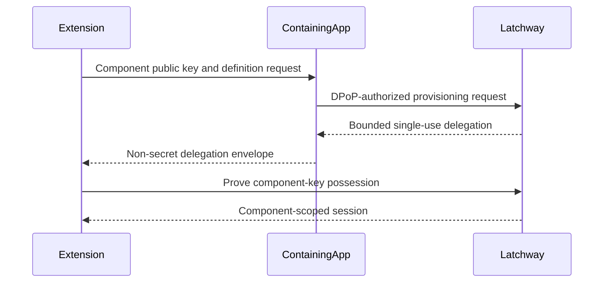

<Warning>
  This pre-release flow is defined by draft contract `1.0.0` and wire protocol `2`.
  Implementations must follow the OpenAPI and generated SDK reference rather
  than infer a wire format from this page; publication remains gated.
</Warning>

The containing app must already have current direct trust. It authorizes one
component key for one configured Component Definition, application,
environment, family, user relationship, and short lifetime. The extension then
proves possession of that key and obtains its own session family.

## Failure behavior

Reject replay, expiry, component-type mismatch, key substitution,
cross-application use, cross-environment use, identity change, root revocation,
and family revocation. Do not silently create an unscoped component or fall back
to the root session.

## What this establishes

The flow establishes that the directly trusted root authorized the named
component key. It does not establish that the extension independently completed
App Attest. The relationship expires with the delegation or any invalidating
root, family, component, environment, application, or user state.
