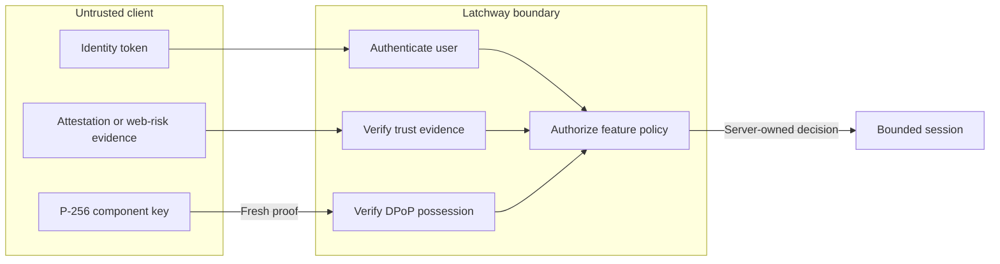

Latchway makes two independent decisions before it issues a client session:

1. **Identity** establishes which signed-in application user is present.
2. **Attestation** establishes what application instance and platform is
   presenting that identity.

Passing one never implies passing the other. The resulting session is also
bound to the installation's P-256 key with DPoP.

## Identity, attestation, and DPoP



### What this establishes

The identity verifier establishes the configured application-user principal.
The attestation verifier establishes a normalized trust result for the
presented application instance or web environment. A valid DPoP proof
establishes possession of the private key bound to the session.

### What this does not establish

Identity does not imply attestation, attestation does not authorize a feature,
and DPoP does not prove that the calling code or device is safe. Web risk
verification is not equivalent to native application attestation.

### What causes the relationship to expire

Identity tokens, one-time attestation challenges, attestation evidence, access
tokens, and refresh state have separate bounded lifetimes. Each DPoP proof is
single-use for its exact method and public URL; revocation or policy changes can
end authorization earlier.

## Identity providers

Your application keeps its existing login and account lifecycle. The SDK asks
your identity callback for a fresh token when it needs to establish a session;
Latchway verifies that token server-side.

Version 1 supports:

| Provider type | Configuration boundary |
| --- | --- |
| Firebase Authentication | Firebase project and the provider's signed ID tokens |
| Supabase Auth | Exact project URL, issuer, and audience |
| Clerk | Exact issuer, audience, algorithms, and key discovery |
| Generic OIDC/JWT | Bounded issuer, audience, authorized party, algorithms, JWKS, and claim mappings |
| Static public key | One operator-pinned asymmetric verification key |
| HS256 | Explicit opt-in plus a server-owned secret and acknowledgement of symmetric-key risk |

Issuer, audience, algorithm, time, and key selection fail closed. Shared JWKS
refresh work is coordinated through PostgreSQL to avoid a replica stampede.
Latchway derives a stable tenant-bounded HMAC lookup from the external subject;
it does not store the raw subject by default.

<Warning>
  Put only a normal user identity token in the SDK callback. Identity-provider
  administration credentials belong in the provider or deployment secret
  manager and must never ship in an application.
</Warning>

## Attestation providers

| Client platform | Production provider | Normalized boundary |
| --- | --- | --- |
| iOS / React Native iOS | Apple App Attest | Native application or policy-approved hardware trust |
| Android / React Native Android | Google Play Integrity | Verdict-derived application and device trust |
| Web | Firebase App Check | Web risk verification |
| Web | Cloudflare Turnstile | Web risk verification |
| Local development | Signed debug evidence | Debug only |

Web risk signals are intentionally weaker than native attestation. A web token
cannot satisfy a feature policy requiring native trust.

### Apple App Attest

The active policy pins the App ID prefix, bundle ID, Apple environment, exact
launch-validation categories, and exact `CFBundleVersion` build numbers. The
server validates the Apple certificate chain, application identity, one-time
challenge binding, attested key, assertion signature, and monotonic counter.
It accepts both Apple's legacy authenticator encoding and the current encoding
that marks extension data explicitly. Current CodeDirectory-hash extensions
must be a complete, well-formed SHA-256 pair; malformed, partial, unknown, or
unrelated extensions fail closed.

| Signed executable | App Attest environment | Validation category |
| --- | --- | ---: |
| Development signing | `development` | `3` |
| TestFlight | `production` | `2` |
| App Store | `production` | `4` |
| Ad hoc or enterprise distribution | `production` | `5` |

Category `1` identifies an operating-system executable; it is not a default for
a third-party application. Categories `7`, `8`, and `9` represent restricted
system-generated binaries and are rejected. Pin only the categories required by
the deployment. The bundle-version allowlist uses `CFBundleVersion` (normally
`CURRENT_PROJECT_VERSION`), not `CFBundleShortVersionString` or
`MARKETING_VERSION`.

Development and production App Attest environments are not interchangeable.
Production proof requires the matching entitlement, an Apple-signed build, and
a supported physical device.

### Google Play Integrity

The active policy pins the package name, numeric Cloud project, signing
certificate digests, version-code range, licensing requirement, device verdict,
and credential source. The native SDK passes the server's canonical challenge
binding directly as Play Integrity `requestHash`; the server validates the
decoded request, application, account, and device details.

Production proof requires the exact signed application installed from the
configured Google Play track. A sideloaded APK is not equivalent.

### App Check and Turnstile

Firebase App Check pins the Google project number and allowed Firebase app IDs.
Turnstile pins exact HTTPS hostnames and an expected action and uses a
server-owned validation secret. Web environments also pin exact canonical
HTTPS origins.

These tokens are short-lived challenge evidence. They are not retained in
normal request records or logs.

## Session bootstrap sequence

```mermaid
sequenceDiagram
    accTitle: Session bootstrap sequence
    accDescr: From top to bottom, the application supplies a fresh identity token, the SDK asks Latchway for a one-time challenge bound to its P-256 public key, the platform produces challenge evidence, and Latchway verifies identity, evidence, and key binding before storing rotating session state in PostgreSQL and returning a bounded session.

    participant App as Application
    participant SDK as Latchway SDK
    participant Platform as Trust provider
    participant Gateway as Latchway
    participant DB as PostgreSQL

    App->>SDK: Fresh identity token callback
    SDK->>Gateway: Session challenge + component public key
    Gateway->>DB: Persist one-time challenge binding
    Gateway-->>SDK: Canonical challenge
    SDK->>Platform: Obtain challenge-bound evidence
    Platform-->>SDK: Attestation or web-risk token
    SDK->>Gateway: Identity + evidence + key binding
    Gateway->>Gateway: Verify identity, evidence, and DPoP key
    Gateway->>DB: Consume challenge; create rotating session family
    Gateway-->>SDK: Short-lived access token + refresh state
```

### What this establishes

The sequence establishes that Latchway issued a session only after it verified
the configured identity input, challenge-bound trust evidence, and the public
key to which the session is bound. PostgreSQL makes challenge consumption and
refresh-family state authoritative across replicas.

### What this does not establish

A successful bootstrap does not make later requests valid without fresh DPoP,
does not attest arbitrary delegated components, and does not create a
long-lived bearer credential. Refresh does not silently replace identity
reauthentication or an attestation step-up.

### What causes the relationship to expire

The bootstrap challenge is one-time and short-lived. Evidence, access tokens,
and refresh credentials expire independently; refresh rotates on every
successful use, while reuse or revocation terminates the affected credential
family.

## Session lifecycle details

1. The SDK creates or loads a P-256 installation key.
2. `POST /client/v1/session-challenges` binds application, environment,
   identity provider, platform, identity token, and DPoP public key.
3. The SDK obtains platform evidence for the returned one-time challenge.
4. `POST /client/v1/sessions` verifies identity and evidence and issues a
   short-lived DPoP-bound access token plus rotating refresh state.
5. Refresh rotates the refresh credential on every successful use. Reuse
   revokes the affected credential family.

Identity reauthentication or attestation step-up creates a new challenge;
refresh does not silently replace either proof. Revoking an installation
invalidates sessions and causes native SDKs to destroy their local installation
material at the terminal boundary.

Continue with [Physical-device proof](/mobile/device-proof) before enabling a
production native policy.
