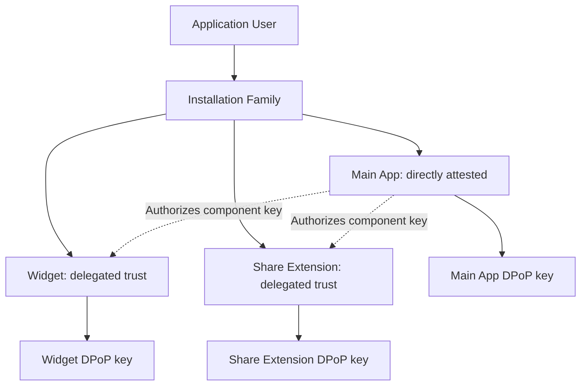

<Warning>
  Installation Families are implemented in pre-release draft contract `1.0.0` on current
  wire protocol `2`. They are not a published support claim; wire `1` retains
  the legacy response shape for compatible clients.
</Warning>

An **Installation Family** groups related client components for one application
user and one logical application installation. It is the parent for policy,
trust provenance, aggregate visibility, and family-wide revocation.

## Installation Family hierarchy

Every Client Component has an independent P-256 key, DPoP identity, session
family, rotating refresh-token chain, feature scope, quota attribution, and
revocation state. Components never share a rotating refresh token.

### What this establishes

Direct attestation establishes evidence about the root application instance.
A valid delegation establishes that the attested root authorized a named
component key under a configured Component Definition.

### What this does not establish

Delegation does not establish that the extension independently completed App
Attest. An Installation Family is also not a physical-device identifier and
must not be used for cross-application or cross-environment correlation.

### What causes the relationship to expire

An unconsumed delegation ends after its short lifetime or successful use. An
established delegated relationship can end on root trust expiry, user sign-out,
component revocation, family revocation, application or environment mismatch,
or policy change. Family revocation must invalidate every component and its
session family.
