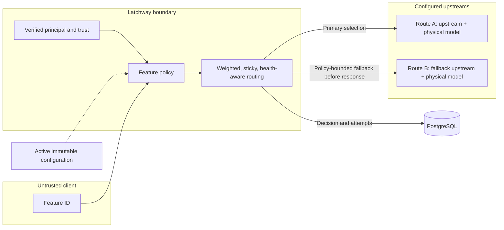
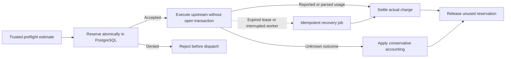

import { QuotaPreview } from "/components/QuotaPreview.jsx";

Applications request a **feature**, not an upstream credential or trusted
physical model. The active immutable configuration maps that feature to policy,
limit plans, routes, upstreams, physical models, pricing, and retry behavior.

## Feature routing

### What this establishes

The client requests a feature while the active server configuration owns
policy, routes, weights, sticky inputs, upstreams, credentials, physical
models, pricing, and fallback eligibility. Verified principal and trust inputs
can influence a decision without becoming client assertions.

### What this does not establish

Feature access does not promise a stable provider or physical model, and a
client cannot force a fallback. A configured fallback edge does not authorize
a second attempt after response bytes have been committed.

### What causes the relationship to expire

A route decision is bounded to one logical request and its active
configuration revision. Health, sticky-policy lifetime, configuration
activation, revocation, or retry eligibility can change later decisions
without changing the client-facing feature ID.

Routing evaluates server-owned inputs such as platform, normalized trust,
verified identity claims, plan, health, configured weights, and sticky keys.
The client cannot override the selected upstream, physical model, credential,
or price.

Latchway supports protocol-aware dispatch for OpenAI Chat Completions,
Responses, Embeddings, Anthropic Messages, and explicitly restricted opaque
HTTP routes. Protocol adapters bound and rewrite trusted fields before network
dispatch.

An upstream attempt may retry or fall back only when the route policy permits
it and no response bytes have been committed. The logical request is counted
once even when it has multiple upstream attempts.

An `upstream_attempts` limit controls those physical dispatches directly. It
can use a calendar window, a token bucket, or a per-request maximum. Latchway
reserves each stateful attempt unit before dispatch and evaluates a
per-request rule against the next contiguous attempt number, so a denied retry
never creates an attempt row or sends upstream bytes.

## Trusted input preflight

When a hard input, total-token, or input-priced cost limit applies, Latchway
must prove a conservative model-aware input estimate before dispatch. Rich
input that cannot be safely accounted for fails closed rather than bypassing a
quota.

## Reserve-execute-settle quota lifecycle

### What this establishes

Atomic reservation prevents concurrent requests from independently spending
the same available limit. Upstream execution occurs without holding a database
transaction, and settlement is idempotent across normal completion and job
recovery.

### What this does not establish

A reservation is not a bill, does not guarantee upstream success, and does not
make an untrusted client token count authoritative. Unknown usage is not
refunded as zero, and an estimate that cannot safely prove a hard bound fails
closed.

### What causes the relationship to expire

The reservation closes when settlement or conservative recovery records the
final charge and releases only the unused remainder. Concurrency leases are
bounded and recoverable; limit windows and immutable configuration revisions
expire or are replaced according to their own policy.

1. Estimate the worst permitted usage and atomically reserve every applicable
   quota and concurrency lease in PostgreSQL.
2. Dispatch without holding an open database transaction.
3. Parse provider-reported usage where trustworthy, otherwise apply the
   configured conservative accounting rule.
4. Settle to actual charge or release the unused reservation idempotently.

This design prevents concurrent overspend and avoids refunding unknown usage as
zero. Quotas can compose across environment, feature, plan, user override, and
abuse-control scopes.

Cost rules default to `costRetryTreatment: actual_attempts`, which charges each
physical dispatch. A rule whose scope includes `user` may opt into
`initial_attempt_only` when a product allowance should absorb retry overhead.
The same plan must pair that rule with an `actual_attempts` cost rule whose
scope includes `organization` and excludes `user`. This option does not erase
physical attempt usage; organization cost accounting continues to include
every attempt and supplies the durable bound for retry cost.

<QuotaPreview />

The preview teaches the lifecycle with illustrative token units. It is not an
authoritative tokenizer, price calculator, or policy simulator; server-owned
preflight and the active immutable revision determine the real reservation.

## Operator verification

Use route simulation against an exact configuration revision before activation.
After traffic begins, inspect the logical request and its ordered attempts,
including selected route, upstream, physical model, timing, usage and cost
provenance, and sanitized failure category.
