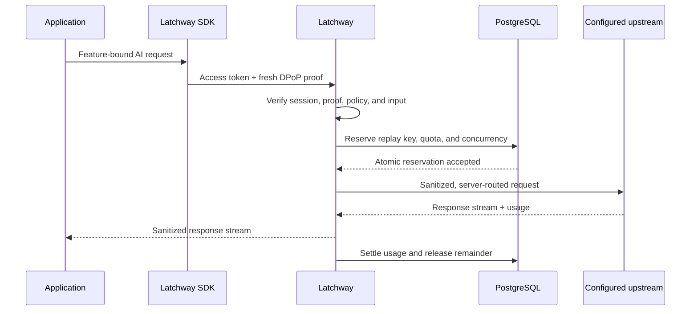

Latchway assumes the application client is untrusted. A client can request a
configured feature, but it cannot assert a trusted identity, plan, route,
physical model, price, token count, or cost.

## Identity and installation trust are separate

The application keeps its existing login system and supplies a fresh identity
token through the SDK callback. Latchway verifies that token server-side and
derives a pseudonymous internal user. It does not store the raw external
subject by default.

Platform attestation answers a different question: what application instance
is making this request? Production options are:

| Client | Production signal | Normalized boundary |
| --- | --- | --- |
| iOS and React Native iOS | Apple App Attest | Native application or approved hardware trust |
| Android and React Native Android | Google Play Integrity | Verdict-derived application and device trust |
| Web | Firebase App Check or Cloudflare Turnstile | Web risk verification only |
| Local tests | Signed debug attestation | Debug only |

Web signals are intentionally weaker than hardware-backed native attestation.
They cannot satisfy a policy that requires native trust.

## Device-bound sessions

The SDK creates a P-256 installation key and proves possession with RFC 9449
DPoP. After identity and attestation pass, Latchway issues a short-lived access
token and rotating refresh state bound to that key. Proofs are single-use and
bound to the exact method and public URL.

SDKs reject cross-origin authorization, redirects, caller-supplied DPoP or
authorization, cookies, and known provider-credential fields. They retry only
an exact bounded pre-dispatch session or nonce challenge. They do not replay a
request that might have reached an upstream.

## Protected AI request sequence

### What this establishes

Latchway verifies the proof-bound session and reserves replay, quota, and
concurrency state before dispatch. It selects the route and credentials on the
server, sanitizes both directions, and settles one logical request after the
upstream attempt lifecycle.

### What this does not establish

A valid session does not guarantee that policy admits the request or that an
upstream succeeds. A retry is not safe merely because a request body is
replayable, and fallback is forbidden after response bytes have been committed
to the client.

### What causes the relationship to expire

The DPoP proof and replay reservation apply to one request. Access tokens,
nonces, quota and concurrency leases, route decisions, and upstream-attempt
state end or rotate on their own bounded lifecycles; settlement or recovery
closes the reservation.

## Protected request pipeline details

1. Apply transport limits and assign a request ID.
2. Verify the access token and DPoP proof; reserve its replay key.
3. Resolve tenant, pseudonymous user, installation, and active configuration.
4. Normalize the protocol request and evaluate feature policy.
5. Estimate and reserve quotas before network dispatch.
6. Select the server-controlled route, upstream, and physical model.
7. Strip forbidden headers, enforce destination policy, rewrite bounded fields,
   and inject the server-held credential.
8. Stream the response while parsing metered usage.
9. Record redacted attempts and settle or release the reservation idempotently.

No fallback occurs after response bytes reach the client.

## Data minimization

Normal request and usage views contain routing, timing, metering, and cost
provenance. They exclude prompt and response bodies, raw external identity
subjects, attestation proofs, access or refresh tokens, DPoP private keys, and
provider credentials.
