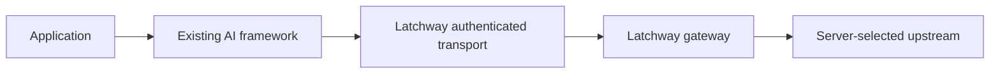

<Warning>
  These pre-release pages define acceptance contracts. No first-party named
  framework adapter is released or supported until its package, exact version
  range, compatibility entry, generated example, and conformance evidence are
  published together.
</Warning>

Keep your framework. Replace or extend its network transport. Bind that
transport to a Latchway feature.

## Framework-transparent integration

### What this establishes

A compatible request-time extension point lets the framework preserve its
application-facing API while Latchway owns feature binding, session lifecycle,
DPoP, redirect and destination checks, routing, quota, and safe response
streaming underneath it.

### What this does not establish

A configurable base URL or static header alone does not establish full DPoP.
The framework's chats, prompts, agents, tools, memory, structured-output logic,
and RAG state remain framework concerns, and an example does not establish a
released compatibility claim.

### What causes the relationship to expire

Each request needs current session authorization and a fresh DPoP proof. The
transport binding remains supported only for the exact framework, adapter,
SDK, server, contract, protocol, platform, and security-level range recorded
in the generated compatibility matrix.

Latchway owns identity input, trust verification, component identity, session
lifecycle, DPoP, feature context, authorization, quotas, routing, metering, and
safe observability. It does not own chats, prompts, agents, tools, memory,
structured-output APIs, RAG, or framework session state.

## Integration classes

| Class | Extension point | Decision |
| --- | --- | --- |
| A: transport-injectable | Custom fetch, URLSession, HTTP client, OkHttp interceptor, middleware, or call factory | Preferred when request-time signing, redirect checks, streaming, and cancellation survive. |
| B: provider-extensible | A model or provider protocol | Implement the framework's protocol and use an existing Latchway transport underneath. |
| C: static configuration only | Base URL, static API key, or static headers | Insufficient for full DPoP unless the framework gains a safe request-time hook. |

## Support rule

“Supported” means a generated compatibility row names the framework version,
adapter version, Latchway SDK version, server range, contract, protocol,
platform, security level, and passing conformance evidence. A README example or
successful one-off request is not support evidence.
