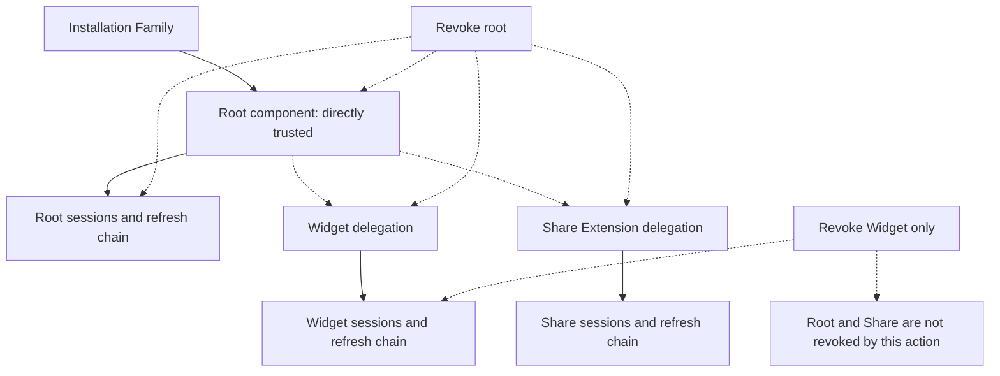

<Warning>
  These revocation semantics are a pre-release target and are not exposed by
  the current Admin API.
</Warning>

## Root revocation propagation

### What this establishes

Root revocation is authoritative for the root credential family and every
delegation whose trust provenance depends on that root. Family revocation is
broader still, while child-only revocation remains isolated to the selected
component and its credential family.

### What this does not establish

Delegated children are not directly attested because their sessions once
derived from a trusted root. Revoking one child does not revoke the root or a
sibling, and cache state cannot extend authorization beyond the contract's
bounded revocation behavior.

### What causes the relationship to expire

Root or family revocation ends the derived relationship immediately at the
authoritative boundary. Root trust expiry, delegation expiry, component
revocation, user sign-out, identity change, application or environment
mismatch, and policy changes can also terminate affected credentials.

| Action | Required effect |
| --- | --- |
| Revoke one component | Reject its access sessions, refresh chain, pending delegations, and future requests. |
| Revoke the root component | Reject root credentials and every delegation that derives from that root. |
| Revoke the Installation Family | Reject every component, session family, refresh chain, and outstanding provisioning authorization in the family. |
| Sign out or change application user | Invalidate credentials associated with the prior identity relationship. |

Revocation must be authoritative across replicas. Cached authorization cannot
extend a revoked component's access beyond the final contract's explicit
bounded behavior.
