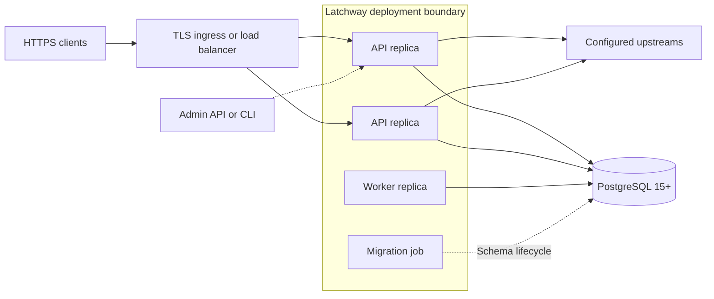

Latchway's source builds one non-root OCI candidate for API, worker, migrations,
diagnostics, CLI commands, and the embedded administration console. PostgreSQL
15 or newer is the only required external service. The checked-in release
Compose template pins PostgreSQL 18.6 by immutable multi-architecture digest
and mounts `/var/lib/postgresql`, the PostgreSQL 18 image's version-aware data
root.

<Warning>
  No stable version 1 image has been published. Treat source-built images as
  evaluation candidates until release promotion and provenance checks pass.
</Warning>

## PostgreSQL-only deployment

### What this establishes

API, worker, migration, diagnostics, and CLI roles come from one image, and
PostgreSQL is the only required external service. PostgreSQL-backed state makes
configuration, replay uniqueness, quota reservation, jobs, key rotation, and
recovery authoritative across replicas.

### What this does not establish

The diagram does not prove that a cloud deployment, image publication,
signature, provenance, backup, or restore gate passed. A load balancer, secret
manager, and platform scheduler can be used without becoming hidden Latchway
state stores, and the dashboard or CLI cannot bypass the canonical Admin API.

### What causes the relationship to expire

Worker heartbeats, database leases, sessions, reservations, and operator
credentials are bounded and expire or rotate independently. Configuration
changes take effect through immutable revisions; restoring PostgreSQL requires
the matching master key rather than an in-place key replacement.

## Implemented deployment templates

| Platform | Application and data shape |
| --- | --- |
| [Docker Compose](/operations/deploy-docker-compose) | Immutable release image, explicit migration service, and PostgreSQL |
| [Google Cloud Run](/operations/deploy-google-cloud-run) | Private Cloud SQL, Secret Manager, HTTPS service, and migration job |
| [AWS](/operations/deploy-aws-ecs) | ECS/Fargate, private RDS, Secrets Manager, and HTTPS ALB |
| [Fly.io](/operations/deploy-fly-io) | Fly Machines, attached PostgreSQL, and release-command migrations |
| [Cloudflare](/operations/deploy-cloudflare-containers) | Streaming Worker shim around the same container application |

The core source candidate contains Compose, Terraform, Cloud Run YAML,
Fly, and Cloudflare assets that pass repository-local static validation. That
is source evidence only; it is not an independent deployment review or proof
that an operator account deployed them.

Each platform in the table has a complete walkthrough. Every guide preserves
GHCR as the canonical release registry. Cloud Run and Fly.io can consume the
public GHCR image directly. AWS mirrors the reviewed image into ECR, and
Cloudflare mirrors the verified `linux/amd64` child into Cloudflare Registry,
without rebuilding either copy.

For the current source checkpoint, the PostgreSQL image reference is
`docker.io/library/postgres@sha256:d3e1620b530c944afa6e887d22eb899824da68e19c52024bf98f5220c88a65b2`.
Do not replace it with a mutable tag in a release deployment. PostgreSQL 17 and
older images commonly mounted `/var/lib/postgresql/data`; carrying that mount
forward to PostgreSQL 18 prevents the official image from starting safely.

## Required runtime values

| Value | Purpose |
| --- | --- |
| `LATCHWAY_DATABASE_URL` | PostgreSQL connection string |
| `LATCHWAY_MASTER_KEY` | Independently generated 32-byte root for encrypted secrets and signing material |
| `LATCHWAY_PUBLIC_ORIGIN` | Exact external HTTPS origin used by clients and DPoP |
| `LATCHWAY_ADMIN_BOOTSTRAP_TOKEN` | Temporary first-owner credential; remove after bootstrap |

Keep secrets in the deployment platform's secret manager. Do not place them in
container arguments, Terraform state output, CI logs, or client applications.

The master key must decode to exactly 32 bytes. Generate it once, escrow it
separately from PostgreSQL, and restore the matching value with the database.
Changing it in place is not rotation.

## Process roles

Start with the combined `all` role. At higher scale, run `serve --role api` and
`serve --role worker` separately. Configuration state, replay uniqueness,
quota reservation, job ownership, key rotation, and recovery coordination are
PostgreSQL-backed.

Production requires at least one worker heartbeat. A deployment that starts
only API replicas can be live while correctly remaining unready.

## Network boundary

`LATCHWAY_PUBLIC_ORIGIN` must be the exact external HTTPS origin used by SDKs;
it is DPoP protocol input, not display metadata. Terminate TLS at a trusted
boundary, preserve the external scheme and host correctly, and reject alternate
origins.

Keep PostgreSQL private. Restrict `/metrics` to the scraper or private network.
Publish `/healthz` and `/readyz` only as required by the platform. Never enable
response buffering for SSE, and keep the platform timeout longer than the
longest supported stream.

## Safe rollout

1. Resolve the image by immutable digest and verify its signature, provenance,
   and SPDX attestation.
2. Back up PostgreSQL and prove a restore in isolation.
3. Run `migrate up`, then require `migrate status` to report current equals
   available.
4. Require `/healthz` and `/readyz`; readiness includes required worker
   heartbeat state.
5. Keep the platform request timeout longer than the maximum supported stream.
6. Give `SIGTERM` draining at least the configured 30-second default.
7. Never enable response buffering for server-sent events.

At higher scale, calculate the worst-case combined API and worker connection
pool plus migration, backup, and administration headroom. Leave at least 20
percent database capacity beyond those explicit reservations.

## Cloud evidence boundary

Template rendering and a successful local image do not prove a cloud
deployment. A production-supported claim requires provider-observed evidence
for the exact immutable candidate on every advertised platform: account and
resource identity, resolved image digest, remote migration status, secret
references without values, health/readiness, streaming behavior, and graceful
replacement.

The current source candidate has local static and Compose evidence. Cloud Run,
AWS, Fly.io, and Cloudflare provider receipts remain open release gates.

Protected deployment evidence separates credentials from candidate execution.
Provider and registry authority is captured in jobs that do not check out or
execute candidate source. Candidate validation is credential-free, and the
provider capture job accepts only bounded, hash-verified deployment inputs. The
Cloudflare capture installs and verifies the pinned Wrangler release and uses
`--no-bundle`; the Compose capture imports preloaded immutable images into an
empty Docker credential store and disables pulls. Operators should preserve
that separation when adapting the workflows.

Use the [production-readiness checklist](/operations/production-readiness)
before accepting traffic.
