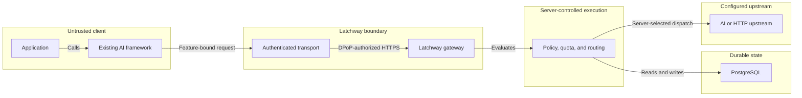
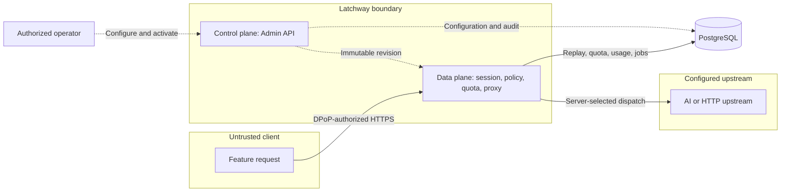

The client chooses a feature. It does not choose an upstream credential,
provider, physical model, price, or route.

## Latchway in one picture

### What this establishes

The SDK transport obtains identity input, uses platform trust evidence, owns the
component key, and creates a fresh DPoP proof. Latchway authenticates the
session, reserves quota, rewrites trusted fields, and dispatches to the route
selected by current server configuration.

### What this does not establish

The path does not make the client trusted, prove that identity or attestation
will pass, or establish support for an unreleased SDK or framework adapter. It
also does not let the client select an upstream credential, route, price, or
physical model.

### What causes the relationship to expire

The DPoP proof is valid for one request. Access tokens, refresh state, trust
evidence, quota reservations, and configuration decisions each end, rotate, or
are revoked on their own bounded lifecycle.

## Control plane versus data plane

### What this establishes

Operators configure applications, identity and attestation providers,
features, routes, limits, pricing, and secrets. Client code cannot write those
resources through the data plane. Both planes share PostgreSQL-backed
coordination, but expose different authentication and authorization surfaces.

### What this does not establish

Access to the data plane does not grant control-plane authority, and an Admin
API credential does not make a client request valid. The diagram does not
imply that PostgreSQL, the dashboard, or an operator can bypass the canonical
Admin API.

### What causes the relationship to expire

Data-plane authorization ends with the request or session lifecycle.
Control-plane decisions are tied to an immutable configuration revision and
are replaced when a later revision is activated; operator sessions and
credentials expire or are revoked independently.

## Current release boundary

The diagram describes the implemented gateway shape and the target transport
boundary. Installation Families and named framework adapters are pre-release
contracts until their server, SDK, compatibility, and conformance evidence is
published.
