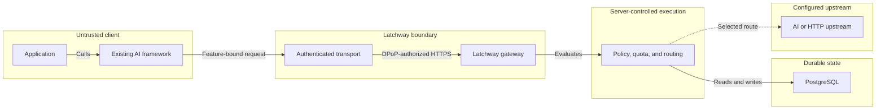

The client chooses a feature. It does not choose an upstream credential,
provider, physical model, price, or route.

## Request boundary

The SDK transport obtains identity input, uses platform trust evidence, owns the
component key, and creates a fresh DPoP proof. Latchway authenticates the
session, reserves quota, rewrites trusted fields, and dispatches to the route
selected by current server configuration.

## Control boundary

Operators configure applications, identity and attestation providers,
features, routes, limits, pricing, and secrets. Client code cannot write those
resources through the data plane.

## Current release boundary

The diagram describes the implemented gateway shape and the target transport
boundary. Installation Families and named framework adapters are pre-release
contracts until their server, SDK, compatibility, and conformance evidence is
published.
